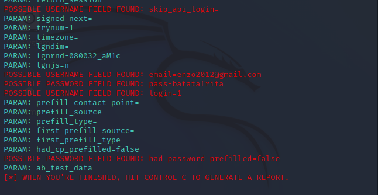

# cibersecurity-desafio-phishing-dio

# Phishing para captura de senhas do Facebook

### Ferramentas

- Kali Linux
- setoolkit

### Configurando o Phishing no Kali Linux

- Acesso root: ``` sudo su ```
- Iniciando o setoolkit: ``` setoolkit ```
- Tipo de ataque: ``` Social-Engineering Attacks ```
- Vetor de ataque: ``` Web Site Attack Vectors ```
- Método de ataque: ```Credential Harvester Attack Method ```
- Método de ataque: ``` Site Cloner ```
- URL para clone: http://www.facebook.com

### Resutados

- Após criada a página clone do facebook foram capturadas com sucesso as 
credênciais de acesso do usuário como mostra o arquivo => 